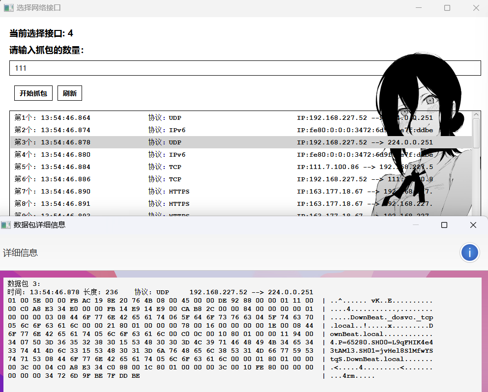

# 主要内容

基于Pcap4j实现类似于wireshark的抓包

# 项目介绍

## 环境：

java8(jdk1.8)，IDEA，Pcap4j，

pcap4j-packetfactory-static-1.8.2.jar用于确定协议类型，可在maven中添加，但是我之前都下好了

其余的可见maven的pom.xml

## 代码

主代码位于`src/main/java`，其中JavaFX_test仅用作测试javaFX，`Main`和`MainUI`是主要的代码，通过UI代码来启动主函数

抓包生成的日志文件格式可通过`scr/resources/logback.xml`进行更改

`style1.css`是针对于第一个页面的样式，背景图片可以随意更改

`style2.css`是针对于第二个页面的样式，背景图片可以随意更改

外部库除了maven中引用，还需要额外加上"环境"中说的pcap4j-packetfactory-static-1.8.2.jar

## 大致样子

- 启动MainUI，第一个页面是获取本机网络接口，点击选择一个即可：

- 选择四号的WIFI网卡，然后可以自己输入抓包的数量，然后点击`开始抓包`即可，点击每一行即可显示详细的数据包

## 缺陷

没有设计暂停按钮，抓包一直抓完才会结束，样式也比较丑陋，水的一个java大作业

